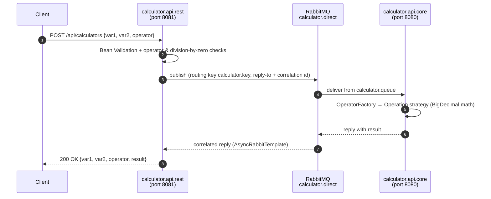

# Calculator REST API - Asynchronous Microservices with RabbitMQ

[](https://github.com/jumba2010/calculator-rest-api-challenge/actions/workflows/ci.yml)


A calculator exposed as a REST API, deliberately split into **two Spring Boot microservices that communicate over
RabbitMQ using the request/reply pattern**. The problem is simple on purpose - the point is the plumbing:
asynchronous messaging, correlation of replies, validation at the edge, extensible domain logic and request tracing.

---

## Architecture



| Module | Responsibility |
|--------|----------------|
| `calculator.api.rest` | Public HTTP edge: validation, error handling, security config, access logging, publishes requests and awaits correlated replies with `AsyncRabbitTemplate`. |
| `calculator.api.core` | Business logic: `@RabbitListener` consumer that computes the result and replies. Stateless, so it can be scaled horizontally as competing consumers on the same queue. |

### Design highlights

- **Request/reply over AMQP** - `AsyncRabbitTemplate.convertSendAndReceiveAsType` handles reply queues and correlation IDs, keeping services decoupled while still offering a synchronous HTTP contract.
- **Strategy + Factory** - each operator is an `Operation` implementation (`Addition`, `Subtraction`, `Multiplication`, `Division`) resolved by `OperatorFactory`; adding a new operation requires no change to the consumer (Open/Closed Principle).
- **Precise arithmetic** - `BigDecimal` everywhere; division rounds `HALF_UP` to 2 decimal places.
- **Fail fast at the edge** - invalid payloads, unknown operators and division by zero are rejected with `400` before a message is ever published.
- **Centralized error handling** - `@RestControllerAdvice` returns a consistent error body; broker unavailability maps to `503 Service Unavailable`.
- **Observability** - HTTP request logging (headers, query string, payload, client info) via `CommonsRequestLoggingFilter` and Logback access logs.

---

## API

`POST /api/calculators`

Supported operators: `add`, `subtract`, `multiply`, `devide`.

```bash
curl -X POST http://localhost:8081/api/calculators \
  -H "Content-Type: application/json" \
  -d '{"var1": 10, "var2": 3, "operator": "devide"}'
```

```json
{ "var1": 10, "var2": 3, "operator": "devide", "result": 3.33 }
```

| Status | When |
|--------|------|
| `200` | Result computed |
| `400` | Missing fields, unknown operator, or division by zero |
| `503` | Core service / broker unreachable |

> Error messages are returned in Portuguese, the language of the original challenge.

---

## Running locally

**Prerequisites:** JDK 8+, Docker.

```bash
# 1. Start RabbitMQ (AMQP on 5672, management UI on http://localhost:15672 - guest/guest)
docker compose up -d

# 2. Start the core (consumer) service
cd calculator.api.core && ./mvnw spring-boot:run

# 3. In another terminal, start the REST edge service
cd calculator.api.rest && ./mvnw spring-boot:run
```

Broker settings can be overridden with `RABBITMQ_HOST`, `RABBITMQ_PORT`, `RABBITMQ_USERNAME` and `RABBITMQ_PASSWORD`.

## Testing

```bash
cd calculator.api.core && ./mvnw test
```

Tests cover each arithmetic strategy, rounding, division by zero, exact decimal addition, factory completeness
and invalid operators.

## Tech stack

Java 8 · Spring Boot 2.4 · Spring AMQP / RabbitMQ · Spring Web · Spring Security · Bean Validation ·
Logback access logging · JUnit 5 · Maven · Docker Compose · GitHub Actions

## Possible improvements

- Dead-letter queue and retry policy for poison messages
- Publish error replies from the consumer instead of relying on the reply timeout
- Micrometer metrics + distributed tracing across both services
- Containerize both services and add them to `docker-compose.yml`

## Author

**Judiao Mbaua** - Senior Backend / Java Software Engineer
[GitHub](https://github.com/jumba2010) · [LinkedIn](https://www.linkedin.com/in/judiao-mbaua-56b39946/)
